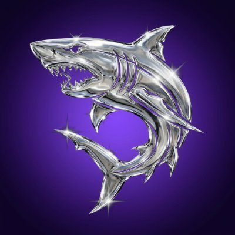
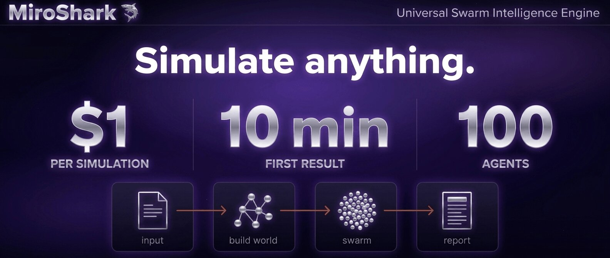
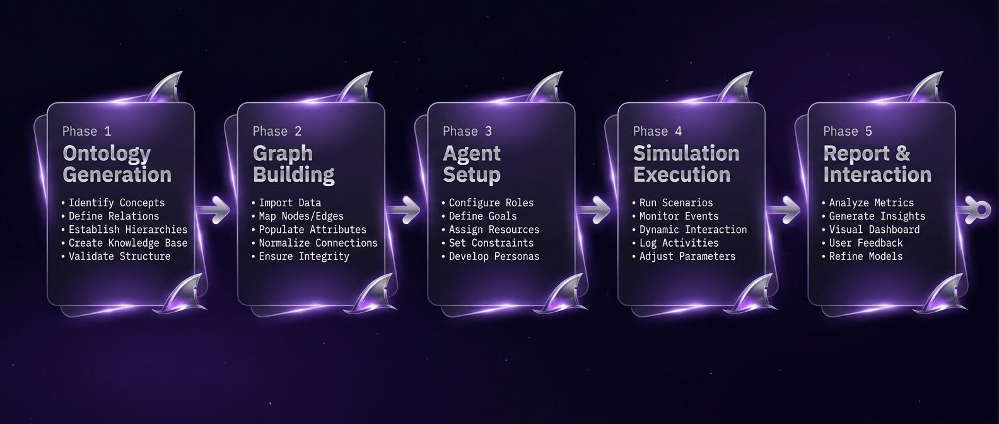
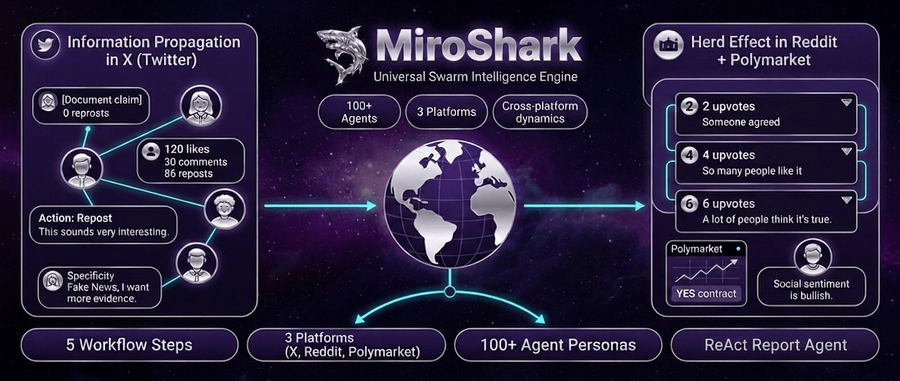
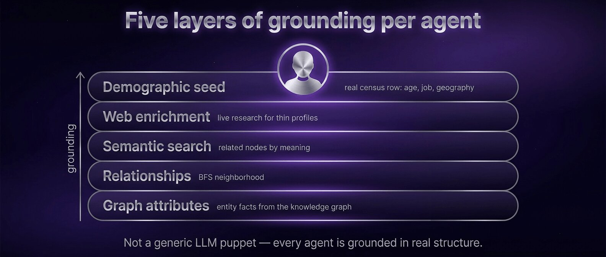
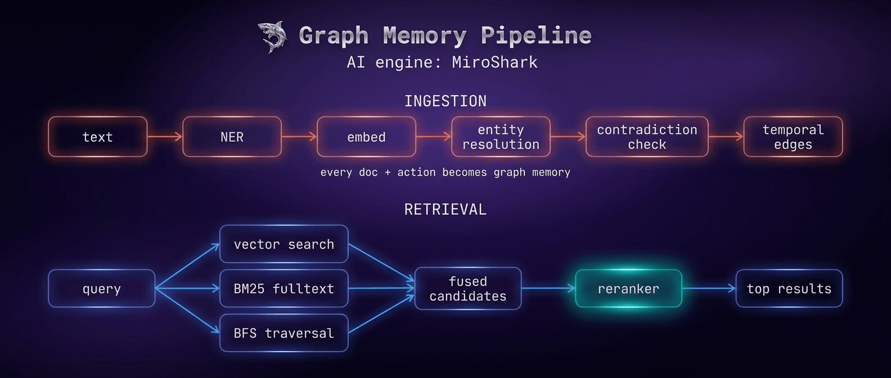

<p align="center">
  
</p>

<h1 align="center">MiroShark</h1>

<p align="center">
  <a href="https://github.com/aaronjmars/MiroShark/stargazers"></a>
  <a href="https://github.com/aaronjmars/MiroShark/network/members"></a>
  <a href="https://x.com/miroshark_"></a>
  <a href="https://bankr.bot/discover/0xd7bc6a05a56655fb2052f742b012d1dfd66e1ba3"></a>
</p>

<p align="center">
  <a href="README.md">English</a> · <a href="README.zh-CN.md">中文</a> · <a href="README.ja.md">日本語</a> · <b>Français</b>
</p>

<p align="center">
  
</p>

---

> **Simulez n'importe quoi, pour 1 $ et en moins de 10 min.**
> Donnez-lui n'importe quoi — un communiqué de presse, un titre d'actualité, un projet de loi, une question sans réponse, une uchronie — et MiroShark fait émerger des centaines d'agents qui y réagissent heure par heure. Ils publient, débattent, échangent, changent d'avis.

<p align="center">
  
</p>

## Ce que ça fait

- Vous apportez un scénario. MiroShark construit le monde autour.
- Des centaines d'agents ancrés dans le réel. Twitter, Reddit et un marché de prédiction. Heure par heure.
- Discutez avec n'importe lequel d'entre eux. Injectez une actualité en cours de route. Bifurquez la chronologie.
- Recevez un rapport sur ce qui s'est passé, citant les publications et les échanges réels.

<p align="center">
  
</p>

## Démarrage rapide

Le chemin recommandé : **une seule clé [OpenRouter](https://openrouter.ai/) + le lanceur `./miroshark`.** Première simulation en ~10 min, ~1 $.

**Prérequis** — Python 3.11+, Node 18+, Neo4j et une [clé OpenRouter](https://openrouter.ai/).

Installez Neo4j — le lanceur le démarre pour vous :

- **macOS** — `brew install neo4j`
- **Linux** — `sudo apt install neo4j` *(ou l'équivalent de votre distribution)*
- **Windows** — installez [Neo4j Desktop](https://neo4j.com/download/) *(natif, avec interface — démarrez la base de données depuis l'application, puis lancez le launcher depuis WSL2 ou Git Bash)*, ou faites tourner toute la stack dans [WSL2](https://learn.microsoft.com/windows/wsl/install) en suivant les étapes Linux
- **Sans installation** — créez une instance cloud gratuite [Neo4j Aura](https://neo4j.com/cloud/aura-free/) et pointez `NEO4J_URI` / `NEO4J_PASSWORD` dessus dans `.env`

Ensuite :

```bash
git clone https://github.com/aaronjmars/MiroShark.git && cd MiroShark
cp .env.example .env
# Collez votre clé OpenRouter dans les emplacements LLM_API_KEY /
# SMART_API_KEY / NER_API_KEY / OPENAI_API_KEY / EMBEDDING_API_KEY
# (la même clé, à 5 endroits). Le duo par défaut est
# Mimo V2.5 + Gemini 3 Flash.
./miroshark
```

Le lanceur vérifie les dépendances, démarre Neo4j, installe le frontend et le backend, puis sert `:3000` + `:5001`. Ctrl+C arrête tout. Ouvrez `http://localhost:3000` et déposez un document.

**Autres chemins** — [déploiement en un clic Railway / Render](../docs/INSTALL.md#one-click-cloud), [Docker + Ollama](../docs/INSTALL.md#option-b-docker--local-ollama), [Ollama manuel](../docs/INSTALL.md#option-c-manual--local-ollama), [Claude Code CLI](../docs/INSTALL.md#option-d-claude-code-no-api-key) — tout est dans **[docs/INSTALL.md](../docs/INSTALL.md)**.

<p align="center">
  
</p>

## Langue de l'interface

Après le lancement, utilisez le sélecteur de langue en haut à droite de la barre de navigation pour basculer entre **English**, **中文** (chinois), **DE** (allemand) et **FR** (français). Votre choix est conservé dans le navigateur, et les titres et descriptions des cartes de la galerie publique suivent la langue active.

## Cas d'usage

- **Test de crise RP** — simulez la réaction du public à un communiqué de presse avant de le publier
- **Réaction du marché** — injectez une actualité financière et observez le sentiment simulé des traders et des investisseurs
- **Publicité** — testez une campagne, un titre ou un pitch face à une audience simulée avant de dépenser
- **Analyse de politiques publiques** — confrontez un projet de réglementation à un public simulé
- **Décision personnelle** — formulez une décision personnelle (changement d'emploi, déménagement, choix du moment d'un lancement) comme un scénario et regardez des personas variés en débattre
- **Uchronie** — réécrivez un événement historique et observez comment une population de personas en raconte autrement les suites
- **Expériences créatives** — donnez un roman dont la fin manque ; les agents écrivent une conclusion cohérente avec le récit

<p align="center">
  
</p>

## Fonctionnalités

Quelques points forts :

| Fonctionnalité | Ce qu'elle fait |
|---|---|
| **Smart Setup** | Déposez un document → trois scénarios Bull / Bear / Neutral générés automatiquement en ~2 s |
| **Just Ask** | Tapez une question sans document — MiroShark mène la recherche et rédige le briefing de départ |
| **Branches contrefactuelles** | Bifurquez une simulation en cours avec un événement injecté (« le PDG démissionne au tour 24 ? ») |
| **Mode Réalisateur** | Injectez une actualité dans la chronologie *en cours* sans la bifurquer |
| **Outils MCP par agent** | Les personas invoquent de vrais outils MCP (recherche web, API) pendant la simulation |
| **Génération d'articles** | Compte rendu façon Substack de ce qui s'est passé, ancré dans les publications et échanges réels |
| **Galerie publique et prédictions vérifiées** | Parcourez et bifurquez chaque simulation publiée sur `/explore` ; suivez les prédictions qui se sont réalisées sur `/verified` |
| **Partagez partout** | Cartes sociales, GIF de replay, fils de tweets, RSS / Atom, intégrations embarquées, et notifications Slack / Discord / Telegram / webhook |

…et **40 de plus** — surfaces de partage, exports, intégrations, observabilité et citation on-chain. Voir la **[liste complète des fonctionnalités et les explications détaillées dans docs/FEATURES.md](../docs/FEATURES.md)**.

<p align="center">
  
</p>

## Documentation

| | |
|---|---|
| [Installation](../docs/INSTALL.md) | Tous les chemins de déploiement : cloud, Docker, Ollama, Claude Code |
| [Configuration](../docs/CONFIGURATION.md) | Variables d'environnement, routage des modèles, feature flags |
| [Modèles](../docs/MODELS.md) | Préréglage cloud, modèles Ollama locaux, résultats de benchmark |
| [Architecture](../docs/ARCHITECTURE.md) | Moteur de simulation, pipeline de mémoire, récupération par graphe |
| [Fonctionnalités](../docs/FEATURES.md) | Plongée dans chaque fonctionnalité du tableau ci-dessus |
| [API HTTP](../docs/API.md) | Chaque endpoint, regroupé par thème — plus une interface Swagger interactive sur `/api/docs` et une spécification sur `/api/openapi.yaml` |
| [CLI](../docs/CLI.md) | Référence de `miroshark-cli` |
| [MCP](../docs/MCP.md) | Intégration Claude Desktop / Cursor / Windsurf / Continue + outils de l'agent de rapport (extraits auto-générés dans Réglages → Intégration IA) |
| [Webhooks](../docs/WEBHOOKS.md) | Payload du webhook de fin, en-têtes, sémantique de livraison, recettes Slack / Discord / Zapier / n8n |
| [Citation DKG](../docs/DKG.md) | Ancrage OriginTrail DKG — UAL + racine de Merkle + clé de citation on-chain pour toute simulation terminée |
| [Archive WaybackClaw](../docs/WAYBACKCLAW.md) | Soumission WaybackClaw — id de snapshot + CID IPFS + id d'événement Nostr pour toute simulation terminée |
| [Observabilité](../docs/OBSERVABILITY.md) | Panneau de débogage, flux d'événements, journalisation |
| [Écosystème](../ECOSYSTEM.md) | Projets, agents et produits construits sur MiroShark |
| [Contribuer](CONTRIBUTING.md) | Installation locale, tests, conventions de PR et comment ajouter un endpoint d'API |

---

## Licence

AGPL-3.0. Voir [LICENSE](../LICENSE).

Soutenir le projet : `0xd7bc6a05a56655fb2052f742b012d1dfd66e1ba3`

## Star History

[](https://www.star-history.com/#aaronjmars/miroshark&Date)
